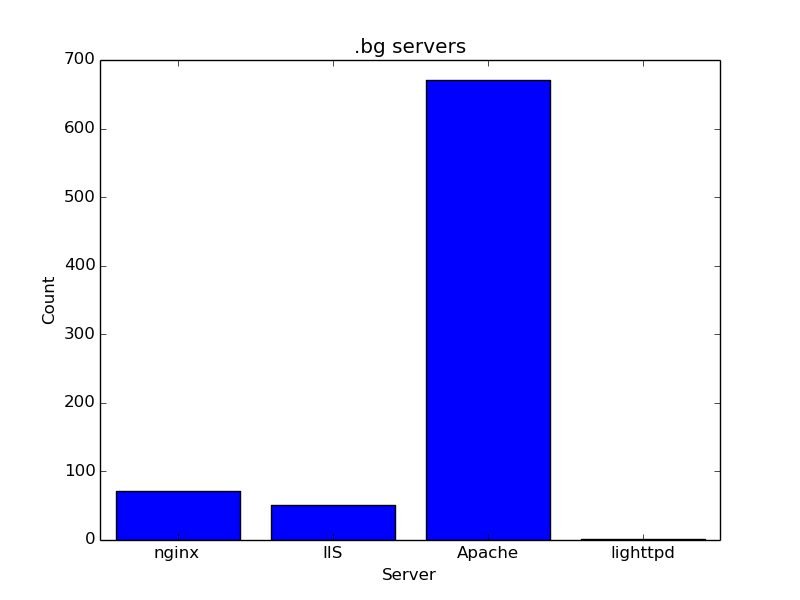

# Crawl the bulgarian web!

We are goint to make a histogram of the server software that runs bulgarian webpages (that end in .bg)

## Crawling vs. API

We are going to distinguish making **HTTP calls to an API** and **crawling websites**!

API means that there is a way to get information in a nicely-structured way. Most of the APIs return JSON data.

For example, GitHub gives us an API: https://api.github.com/users/radorado, which returns JSON. JSON is good because we can easily parse it into data-structures.

But most of the websites do not provide any API. So we have to work for our information - parsing the HTML structure of the websites. **This is called crawling**

## Histogram class

First, we are going to start simple.

Provide a simple `Histogram` class, which can be used like that:

```python
h = Histogram()

h.add("Apache")
h.add("Apache")
h.add("nginx")
h.add("IIS")
h.add("nginx")

h.count("Apache") == 2 # True
h.count("nginx") == 2 # True
h.count("IIS") == 1 # True
h.count("IBM Web Server") is None # True


for key, count in h.items():
    print("{}: {}".format(key, count))
# Apache: 2
# nginx: 2
# IIS: 1
```

## What serves that website?

In order to understand what is the server, running given web site, we need to make HTTP request (for example GET), and see the response headers.

**There is a `Server` header which holds a string with the information.**

For example:

```
$ curl -I https://hackbulgaria.com 
HTTP/1.1 200 OK
Server: nginx/1.6.2
Date: Sat, 25 Apr 2015 21:05:43 GMT
Content-Type: text/html; charset=utf-8
Connection: keep-alive
Vary: Accept-Encoding
X-Frame-Options: SAMEORIGIN
Vary: Cookie
Strict-Transport-Security: max-age=31536000
X-Content-Type-Options: nosniff
X-Frame-Options:: deny
```

As you can see, the `Server: nginx/1.6.2` header gives us the information that `hackbulgaria.com` runs `nginx`.

That's great.

How about Python?

```python
>>> import requests
>>> r = requests.get("https://hackbulgaria.com")
>>> print(r.headers["Server"])
'nginx/1.6.2'
```

Easy as a pie!

## Crawling & Information

Now, if we want to crawl all websites (or almost all websites) that end in .bg, we are going to need a list of them.

We can a big list, around 10 000 pages, from here - http://register.start.bg/

The catch is - there is no API. We will have to crawl our information. **Find all links in the HTML of the page.**

Our hint here is - use [BeautifulSoup](http://www.crummy.com/software/BeautifulSoup/) in order to parse the HTML of the page into more meaningful structures.

Check the structure of the website. There are links that look like `link.php?id=64722`. They are the key to solve that problem. Play with them - see what you can do.

## Histogram of the results

While you crawl all the 10 000 pages, create a histogram of the different web servers that run them.

When you are done, save the result in a file.

You are going to have results which look like that:

```
...
Apache/2.4.7 (Unix) PHP/5.4.25: 1
Apache/2.4.7 (Win64) OpenSSL/1.0.1g mod_fcgid/2.3.9: 1
Apache/2.4.9 (Unix) OpenSSL/1.0.1e-fips mod_bwlimited/1.4: 1
Apache/2: 7
Apache: 384
Apache-Coyote/1.1: 1
Apache mod_fcgid/2.3.7 mod_auth_pgsql/2.0.3: 2
Apashi 1.1 mod_fcgid/2.3.5: 1
cloudflare-nginx: 5
Host.bg redirect server based on Apache/1.3.31 (Unix): 2
IBM_HTTP_Server: 2
lighttpd/1.4.22: 1
Microsoft-IIS/5.0: 5
Microsoft-IIS/6.0: 15
Microsoft-IIS/7.0: 3
Microsoft-IIS/7.5: 23
Microsoft-IIS/8.0: 2
Microsoft-IIS/8.5: 3
nginx/0.7.62: 1
nginx/0.7.65: 1
nginx/0.7.67: 1
nginx/0.8.53: 1
nginx/1.0.10: 3
...
```

## Consolidate Results & Plot Them

As you can see, there are a lot of different versions of Apache or nginx or IIS. If we want to make a more general analysis, we are going to consolidate all Apache results into a single "Apache" entity.

Do so and plot the resulted histogram in a histogram chart that looks something like that:


